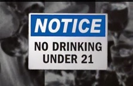

## **Project description**

The supermarket chain Good Seed would like to explore whether Data Science can help them adhere to alcohol laws by making sure they do not sell alcohol to underage people. You are asked to conduct that evaluation, so as you set to work, keep the following in mind:

1. The shops are equipped with cameras in the checkout area which are triggered when a person is buying alcohol
2. Computer vision methods can be used to determine age of a person from a photo
3. The task then is to build and evaluate a model for verifying people's age

To start working on the task, you'll have a set of photographs of people with their ages indicated.

## **Project Instructions**

* Pass a quiz to verify your understanding of the project statement.
* Perform exploratory data analysis to get an overall impression of the dataset.
* Train and evaluate the model (it needs to be done on the GPU platform).
* Combine your code, output and findings (from the previous points) in the final Jupyter notebook.
* Make conclusions of the model evaluation, add them to the notebook.
* Project reviewers will review your final notebook.

## **Conclusion**

In this project, we addressed the challenge posed by Good Seed, a supermarket chain, to ensure compliance with alcohol laws by preventing sales to underage individuals. Leveraging computer vision methods, we developed and evaluated a model for age verification based on photographs captured by cameras in the checkout area.

Our model successfully achieved the desired value metric, with a mean absolute error (MAE) equal to 7.11. However, to expedite the process and reach this target more efficiently, we implemented the technique of early stopping. By monitoring the model's performance during training and halting it when further improvements were unlikely, we obtained the desired result sooner.

Furthermore, we emphasized the importance of conducting a thorough check and analyzing the learning curve. By plotting the learning curve, we gained insights into the model's performance and identified potential areas for optimization or refinement.

### **Future Improvement Projects**

Moving forward, there are several avenues for improvement and expansion:

1. **Data Augmentation**: Enhance the model's robustness by incorporating data augmentation techniques to account for variations in image quality and lighting conditions.
   
2. **Model Architecture Exploration**: Explore alternative model architectures, such as convolutional neural networks (CNNs), to potentially improve accuracy and efficiency in age verification.
   
3. **Real-time Implementation**: Develop a real-time age verification system that can process images in real-time at the checkout, ensuring timely compliance with alcohol laws.
   
4. **Continuous Model Monitoring**: Implement a system for continuous monitoring of the age verification model's performance in real-world scenarios and update the model as necessary to maintain effectiveness.

In conclusion, while our current model has achieved success in age verification, ongoing improvement projects will ensure the continued effectiveness and reliability of our system in preventing underage alcohol sales at Good Seed supermarkets.

<d>
 
