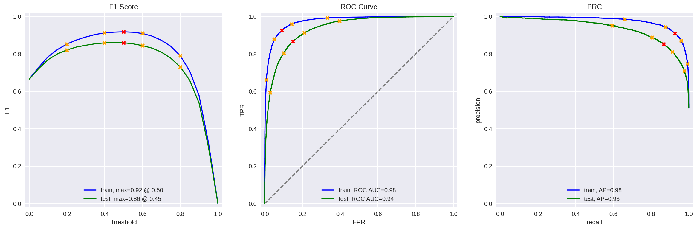

# **Project Description**

The Film Junky Union, a new edgy community for classic movie enthusiasts, is developing a system for filtering and categorizing movie reviews. The goal is to train a model to automatically detect negative reviews. You'll be using a dataset of IMBD movie reviews with polarity labelling to build a model for classifying positive and negative reviews. It will need to reach an F1 score of at least 0.85.

### **Project Instructions**

1. Load the data.
2. Preprocess the data, if required.
3. Conduct an EDA and make your conclusion on the class imbalance.
4. Preprocess the data for modeling.
5. Train at least three different models for the given train dataset.
6. Test the models for the given test dataset.
7. Compose a few of your own reviews and classify them with all the models.
8. Check for differences between the testing results of models in the above two points. Try to explain them.
9. Present your findings.

Important! The project template already contains some code snippets for your convenience, so you can use them if you'd like. If you want to start right away from a clean sheet, just remove all those code snippets. Here's the list of code snippets:

1. A bit of EDA with some plots
2. `evaluate_model()`
    1. a routine to evaluate a classification model which conforms to the scikit-learn predict interface
3. `BERT_text_to_embeddings()`
    2. a routing to convert a list of texts into embedding with BERT

The main job to build and evaluate models is your own.

As you can see from the project template, we suggest trying classification models based on logistic regression and gradient boosting, but feel free to try other methods. You can mess around with the project template's structure as long as the project's instructions are completed.

You don't have to use BERT for the project because it is very demanding for computational power and will be very slow on the CPU for the complete dataset. Because of this, BERT usually needs to be executed on GPU for adequate performance. However, you are more than welcome to try and include BERT in the project for a part of the dataset. If you want to do this, we suggest doing so locally and only taking a couple hundred of objects per each part of the (train/test) dataset to avoid waiting too long. Make sure to indicate your use of BERT in the first cell (the header of your project).

### **Data Description**

The data is stored in the `imdb_reviews.tsv` file.[ Download the dataset](https://practicum-content.s3.us-west-1.amazonaws.com/datasets/imdb_reviews.tsv).

_The data was provided by Andrew L. Maas, Raymond E. Daly, Peter T. Pham, Dan Huang, Andrew Y. Ng, and Christopher Potts. (2011). Learning Word Vectors for Sentiment Analysis. The 49th Annual Meeting of the Association for Computational Linguistics (ACL 2011)._

Here's the description of the selected fields:

1. `review`: the review text
2. `pos`: the target, '0' for negative and '1' for positive
3. `ds_part`: 'train'/'test' for the train/test part of dataset, correspondingly

There are other fields in the dataset. Feel free to explore them if you'd like.

## Conclusion

### Data Preparation and EDA

A dataset comprising over 40,000 rows and 15+ columns, primarily focusing on movie reviews from IMDB, was loaded and examined. Despite encountering a few N/A values, the dataset required minimal cleanup. Exploratory data analysis (EDA) provided insights into the distribution of the target variable (positive/negative reviews) and revealed the frequency of reviews per movie.

### Preprocessing and Modeling

Before model initialization, a preprocessing step was undertaken to normalize features, removing digits, punctuation marks, and other elements from the reviews. Three models were trained and evaluated: Logistic Regression (LR) with NLTK preprocessing, LR with spaCy preprocessing, and LightGBM with spaCy preprocessing. Additionally, a dummy model was developed for benchmarking purposes.

### Experimental Results

The LR models consistently outperformed the dummy model, achieving F1 scores exceeding the target threshold of 0.85. Both LR models, with NLTK and spaCy preprocessing, achieved F1 scores of 0.88, while the LightGBM model attained a slightly lower score of 0.86.

### Recommendations

1. **Continuous Evaluation**: Regularly monitor and evaluate model performance to ensure its effectiveness over time.

2. **Enhanced Preprocessing Techniques**: Explore advanced preprocessing techniques to further improve model performance and adaptability to different datasets.

3. **Model Optimization**: Experiment with hyperparameter tuning and feature engineering to enhance the models' predictive capabilities.

4. **Resource Management**: Consider computational resources and time constraints when selecting and executing complex models like BERT.

## Future Improvements

1. **BERT Integration**: Explore the integration of BERT for more robust and context-aware sentiment analysis, considering computational limitations and performance trade-offs.

2. **Ensemble Modeling**: Investigate ensemble modeling techniques to combine the strengths of multiple models and improve overall predictive accuracy.

3. **Fine-Tuning**: Conduct fine-tuning of models to optimize hyperparameters and further enhance performance metrics.

4. **Cross-Domain Analysis**: Extend the analysis to include reviews from other domains or platforms to create a more comprehensive sentiment analysis model.

By implementing these recommendations and pursuing future improvements, the Film Junky Union can develop a highly effective system for filtering and categorizing movie reviews, catering to the needs of classic movie enthusiasts while ensuring high-quality recommendations and user experiences.

# LGBM Classifier  Fit Results
 

