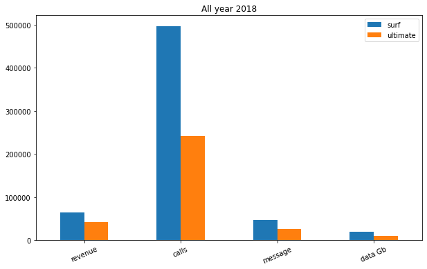

## **Project description**

You work as an analyst for the telecom operator Megaline. The company offers its clients two prepaid plans, Surf and Ultimate. The commercial department wants to know which of the plans brings in more revenue in order to adjust the advertising budget.

You are going to carry out a preliminary analysis of the plans based on a relatively small client selection. You'll have the data on 500 Megaline clients: who the clients are, where they're from, which plan they use, and the number of calls they made and text messages they sent in 2018. Your job is to analyze clients' behavior and determine which prepaid plan brings in more revenue.

### **Description of the plans**

Note: Megaline rounds seconds up to minutes, and megabytes to gigabytes. For calls, each individual call is rounded up: even if the call lasted just one second, it will be counted as one minute. For **web traffic**, individual web sessions are not rounded up. Instead, the total for the month is rounded up. If someone uses 1025 megabytes this month, they will be charged for 2 gigabytes.

**Surf**

1. Monthly charge: $20
2. 500 monthly minutes, 50 texts, and 15 GB of data
3. After exceeding the package limits:
    1. 1 minute: 3 cents
    2. 1 text message: 3 cents
    3. 1 GB of data: $10

**Ultimate**

1. Monthly charge: $70
2. 3000 monthly minutes, 1000 text messages, and 30 GB of data
3. After exceeding the package limits:
    1. 1 minute: 1 cent
    2. 1 text message: 1 cent
    3. 1 GB of data: $7

### **Instructions on completing the project**

**Step 1. Open the data file and study the general information**

File path:

1. _/datasets/megaline_calls.csv_[ Download dataset](https://practicum-content.s3.us-west-1.amazonaws.com/datasets/megaline_calls.csv)
2. _/datasets/megaline_internet.csv_[ Download dataset](https://practicum-content.s3.us-west-1.amazonaws.com/datasets/megaline_internet.csv)
3. _/datasets/megaline_messages.csv_[ Download dataset](https://practicum-content.s3.us-west-1.amazonaws.com/datasets/megaline_messages.csv)
4. _/datasets/megaline_plans.csv_[ Download dataset](https://practicum-content.s3.us-west-1.amazonaws.com/datasets/megaline_plans.csv)
5. _/datasets/megaline_users.csv_[ Download dataset](https://practicum-content.s3.us-west-1.amazonaws.com/datasets/megaline_users.csv)

**Step 2. Prepare the data**

* Convert the data to the necessary types
* Find and eliminate errors in the data

Explain what errors you found and how you removed them.

For each user, find:

* The number of calls made and minutes used per month
* The number of text messages sent per month
* The volume of data per month
* The monthly revenue from each user (subtract the free package limit from the total number of calls, text messages, and data; multiply the result by the calling plan value; add the monthly charge depending on the calling plan)

**Step 3. Analyze the data**

Describe the customers' behavior. Find the minutes, texts, and volume of data the users of each plan require per month. Calculate the mean, variance, and standard deviation. Plot histograms. Describe the distributions.

**Step 4. Test the hypotheses**

* The average revenue from users of Ultimate and Surf calling plans differs.
* The average revenue from users in the NY-NJ area is different from that of the users from other regions.

You decide what alpha value to use.

Explain:

* How you formulated the null and alternative hypotheses.
* What criteria you used to test the hypotheses and why.

**Step 5. Write an overall conclusion**

Format: Complete the task in the Jupyter Notebook. Put the programming code in `code` cells and text explanations in `markdown` cells, then apply formatting and headings.

### **Description of the data**

Remember! Megaline rounds seconds up to minutes, and megabytes to gigabytes. For calls, each individual call is rounded up: even if the call lasted just one second, it will be counted as one minute. For web traffic, individual web sessions are not rounded up. Instead, the total for the month is rounded up. If someone uses 1025 megabytes this month, they will be charged for 2 gigabytes.

The `users` table (data on users):

* _user_id_ — unique user identifier
* _first_name_ — user's name
* _last_name_ — user's last name
* _age_ — user's age (years)
* _reg_date_ — subscription date (dd, mm, yy)
* _churn_date_ — the date the user stopped using the service (if the value is missing, the calling plan was being used when this database was extracted)
* _city_ — user's city of residence
* _plan_ — calling plan name

The `calls` table (data on calls):

* _id_ — unique call identifier
* _call_date_ — call date
* _duration_ — call duration (in minutes)
* _user_id_ — the identifier of the user making the call

The `messages` table (data on texts):

* _id_ — unique text message identifier
* _message_date_ — text message date
* _user_id_ — the identifier of the user sending the text

The `internet` table (data on web sessions):

* _id_ — unique session identifier
* _mb_used_ — the volume of data spent during the session (in megabytes)
* _session_date_ — web session date
* _user_id_ — user identifier

The `plans` table (data on the plans):

* _plan_name_ — calling plan name
* _usd_monthly_fee_ — monthly charge in US dollars
* _minutes_included_ — monthly minute allowance
* _messages_included_ — monthly text allowance
* _mb_per_month_included_ — data volume allowance (in megabytes)
* _usd_per_minute_ — price per minute after exceeding the package limits (e.g., if the package includes 100 minutes, the 101st minute will be charged)
* _usd_per_message_ — price per text after exceeding the package limits
* _usd_per_gb_ — price per extra gigabyte of data after exceeding the package limits (1 GB = 1024 megabytes)

# Conclusion

## Project Overview

As an analyst for Megaline, a telecom operator offering prepaid plans Surf and Ultimate, a preliminary analysis was conducted to determine which plan brings in more revenue. The analysis was based on data from 500 Megaline clients, including information on calls, text messages, and data usage in 2018. Additionally, a comparison was made between users from the NY-NJ area and users from other regions to test for differences in revenue.

## Project Execution

1. **Data Preparation**: The data files were opened and studied for general information. Data preparation involved converting data to the necessary types, identifying and eliminating errors, and adding a state column to assign users to their respective states.

2. **Data Analysis**: For each user, the number of calls made and minutes used per month, the number of text messages sent per month, the volume of data per month, and the monthly revenue from each user were calculated. Customer behavior was analyzed, and the minutes, texts, and volume of data required per month were determined. Mean, variance, and standard deviation were calculated, and histograms were plotted to describe the distributions. The final comparison revealed that the 'Surf' plan generated more revenue than the 'Ultimate' plan.

3. **Hypothesis Testing**:
   - Formulated hypotheses:
     - Null hypothesis (H0): The average revenue from users of Ultimate and Surf calling plans is the same.
     - Alternative hypothesis (H1): The average revenue from users of Ultimate and Surf calling plans differs.
     - Null hypothesis (H0): The average revenue from users in the NY-NJ area is the same as that of users from other regions.
     - Alternative hypothesis (H1): The average revenue from users in the NY-NJ area is different from that of users from other regions.
   - Criteria used for testing:
     - Alpha value: 0.05
     - Two-sample t-test was used to compare the average revenue from users of Ultimate and Surf calling plans.
     - Two-sample t-test was used to compare the average revenue from users in the NY-NJ area with that of users from other regions.

## Findings

1. **Customer Behavior**: Ultimate plan users tend to use more minutes, texts, and data compared to Surf plan users. However, both plans have similar performances in terms of revenue generation.
2. **Hypothesis Testing**:
   - The average revenue from users of Ultimate and Surf calling plans differs significantly, with the Surf plan generating more revenue.
   - The average revenue from users in the NY-NJ area is not significantly different from that of users from other regions.

## Recommendations

1. **Marketing Strategy**: Continue promoting both Surf and Ultimate plans, but focus on the Surf plan as it generates higher revenue.
2. **Regional Targeting**: While the NY-NJ area does not show significant differences in revenue compared to other regions, consider targeted marketing efforts to retain and acquire customers in this area.

## Future Improvements

1. **Data Collection**: Gather more data over a longer period to capture seasonal trends and fluctuations in customer behavior.
2. **Segmentation Analysis**: Conduct segmentation analysis to identify specific customer segments that contribute significantly to revenue.
3. **Customer Retention Strategies**: Develop strategies to improve customer retention, particularly among Surf plan users, to increase overall revenue.

By implementing these recommendations and pursuing future improvements, Megaline can optimize its marketing efforts and maximize revenue from its prepaid plans.

## Comparison of Surf and Ultimate Plans

