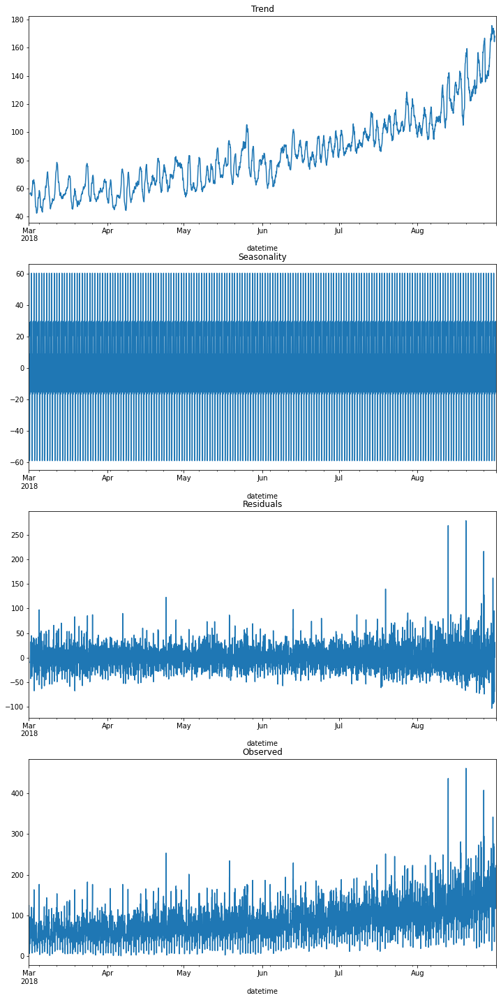

# **Project description**

Sweet Lift Taxi company has collected historical data on taxi orders at airports. To attract more drivers during peak hours, we need to predict the amount of taxi orders for the next hour. Build a model for such a prediction.

## The RMSE metric on the test set should not be more than 48.

### **Project instructions**

1. Download the data and resample it by one hour.
2. Analyze the data.
3. Train different models with different hyperparameters. The test sample should be 10% of the initial dataset.
4. Test the data using the test sample and provide a conclusion.

### **Data description**

The data is stored in the `/datasets/taxi.csv` file.[ Download the dataset](https://practicum-content.s3.us-west-1.amazonaws.com/datasets/taxi.csv).

The number of orders is in the `num_orders` column.

# Conclusion

## Project Overview

Sweet Lift Taxi company aimed to predict the amount of taxi orders for the next hour using historical data collected at airports. The goal was to attract more drivers during peak hours by accurately forecasting demand. The project required building a model with an RMSE metric on the test set of no more than 48.

## Project Execution

1. **Data Preprocessing**: The data from the `/datasets/taxi.csv` file was downloaded and resampled by one hour. Analysis of the data revealed a consistent growth trend in the number of orders, peaking during the month of August.

2. **Model Training**:
   - Different models with various hyperparameters were trained, including Linear Regression, CatBoost, and Random Forest.
   - The dataset was split into training and testing sets, with 10% reserved for testing.

3. **Model Evaluation**:
   - Linear Regression achieved an RMSE value of -31.26 on the testing set.
   - CatBoost outperformed Linear Regression with an RMSE of -25.53, demonstrating superior results.
   - Random Forest, while performing better than Linear Regression, fell short compared to CatBoost.
   - GridSearchCV was used to identify the optimal hyperparameters for the Random Forest algorithm.

4. **Final Model Selection**:
   - CatBoost was determined to be the optimal prediction algorithm for Sweet Lift Taxi company, with an RMSE of 46.67 on the testing set.

## Findings

- CatBoost demonstrated the most superior performance among the trained models.
- Concerns arise regarding the seasonal influence on taxi demand, especially during the winter months.
- Further investigation is warranted to assess the impact of seasonal fluctuations on airport passenger traffic, particularly if the airport serves as a resort location with reduced operations during the winter season.

## Recommendations

1. **Seasonal Analysis**: Conduct a comprehensive analysis to understand the seasonal variations in taxi demand and airport passenger traffic.
2. **Continuous Monitoring**: Regularly monitor model performance and retrain as necessary to adapt to changing patterns.
3. **Data Collection**: Expand the dataset to include data from all seasons to ensure the model's robustness across different time periods.
4. **Collaboration**: Collaborate with airport authorities to gather additional insights and data to enhance the accuracy of demand forecasting.

## Future Improvements

1. **Seasonal Adjustment**: Develop methods to adjust model predictions for seasonal variations in taxi demand.
2. **Feature Engineering**: Explore additional features that may influence taxi demand, such as weather conditions, special events, or holidays.
3. **Advanced Modeling Techniques**: Experiment with advanced modeling techniques to further improve prediction accuracy, such as time series forecasting models or ensemble methods.

By implementing these recommendations and pursuing future improvements, Sweet Lift Taxi company can optimize its driver allocation and better meet customer demand, ultimately improving service efficiency and customer satisfaction.

# Example decomposed data set

  

